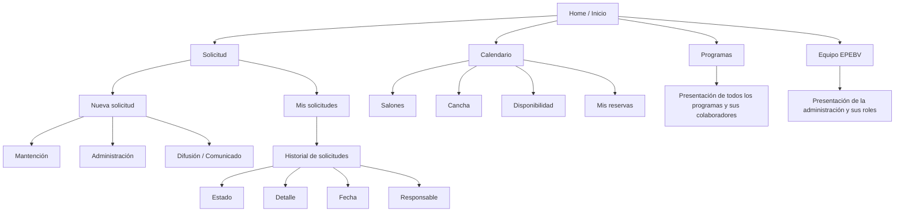

```mermaid
graph TD
    A[Home / Inicio]

    %% Primer nivel
    A --> B[Solicitud]
    A --> C[Calendario]
    A --> D[Programas]
    A --> E[Equipo EPEBV]

    %% Solicitudes
    B --> B1[Nueva solicitud]
    B --> B2[Mis solicitudes]

    B1 --> B1a[Mantención]
    B1 --> B1b[Administración]
    B1 --> B1c[Difusión / Comunicado]

    B2 --> B2a[Historial de solicitudes]
    B2a --> B2a1[Estado]
    B2a --> B2a2[Detalle]
    B2a --> B2a3[Fecha]
    B2a --> B2a4[Responsable]

    %% Calendario
    C --> C1[Salones]
    C --> C2[Cancha]
    C --> C3[Disponibilidad]
    C --> C4[Mis reservas]

    %% Programas
    D --> D1[Presentación de todos los programas y sus colaboradores]

    %% Equipo
    E --> E1[Presentación de la administración y sus roles]
```